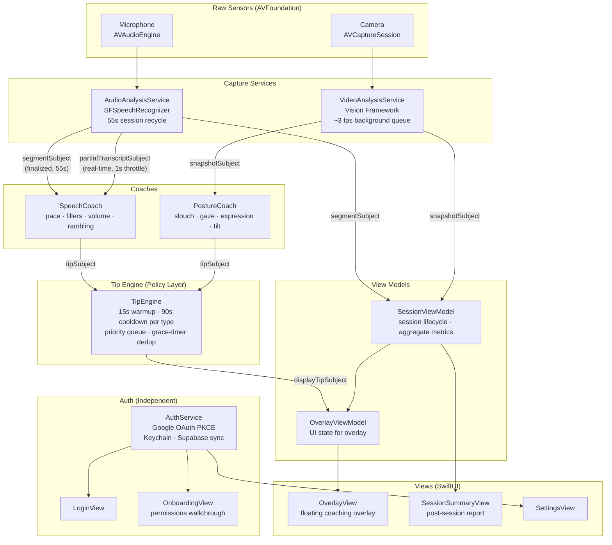
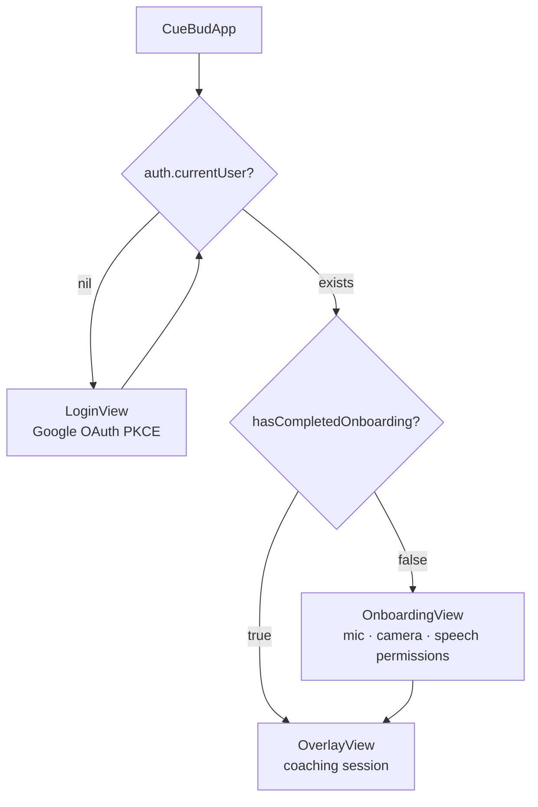

# CueBud Architecture

## High-Level Overview

## App Launch Flow

## Layer Summary

| Layer | Components | Responsibility |
|---|---|---|
| **Sensors** | `AVAudioEngine`, `AVCaptureSession` | Raw mic and camera input |
| **Capture Services** | `AudioAnalysisService`, `VideoAnalysisService` | On-device transcription (SFSpeechRecognizer) and pose/face detection (Vision) |
| **Coaches** | `SpeechCoach`, `PostureCoach` | Emit a `CoachingTip` whenever a condition is observed — no rate-limiting logic |
| **Policy** | `TipEngine` | All display policy: warmup, per-type cooldown, priority queue, grace-timer auto-dismiss |
| **View Models** | `SessionViewModel`, `OverlayViewModel` | Session lifecycle & aggregate metrics; UI state for the overlay |
| **Views** | `OverlayView`, `SessionSummaryView`, `SettingsView`, `LoginView`, `OnboardingView` | SwiftUI UI; overlay floats above all spaces including fullscreen |
| **Auth** | `AuthService`, `KeychainHelper` | Google OAuth PKCE, silent token refresh, Keychain storage, Supabase user upsert — independent of the coaching pipeline |
| **Utilities** | `FillerWordDetector`, `SpeechPaceCalculator`, `AudioLevelMeter`, `PermissionsManager` | Stateless helpers used by capture services and coaches |
